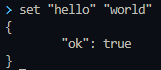
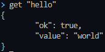
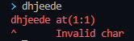

# Key/Value Memory Database 
[](https://github.com/Troxsoft/SkikDB)

## Characteristics
- Easy 
- Simple
- All on `only one` executable
- Basic `autocomplete` in *CLI*

## Data types
- ### String
- ### Number(with decimal or without decimal)
- ### List
- ### JSON
## Examples:
- Set key:
    ```sql

    set "INeedCash" true
    ```
    
- Get key:
    ```sql
    get "INeedCash"
    ```
    
- Get all keys/values:
    ```sql
    get *
    ```
- Delete key:
    ```sql
    delete "INeedCash"
    ```
- Get type of key/value:
    ```sql
    type "INeedCash"
    ```
- Exists key/value:
    ```sql
    exists "INeedCash"
    ```
- Others Examples:
    ```sql
    get * where value < 20
    get 2 where startsWith(key,"+18")
    set "names" ["pepe","nalga","ramirez","a","a2"]
    list "names" addl "donald"
    list "names" addr "frank"
    list "names" delete 1 where index == 0
    list "names" get 1 where index == 0
    get "names"
    list "names" delete *
    get 1 where key == "mykey"
    ```
# Sixtax Error:

# Features:
#### ✔ = 100%
#### 😉 = 50%
#### ❌ = 0%
- List `(add,delete,sort,is repeat,and more)` (😉)
- Limit (✔) 
- Conditions (✔) 
- Data handling `(strings,numbers)` (❌)
- **DB Server** (❌)
- JSON handling (❌)
- Regex (❌)
- Exact type (❌)
- Update message error (❌)
- Add native **API** for go (❌)
- Add **API** using DB server`(go,nodejs,c,c++,rust,python)` (❌)
#### This proyect use [c-bata/go-prompt](!https://github.com/c-bata/go-prompt) for autocomplete in the cli,[fatih/color](https://github.com/fatih/color) for terminal colors
#### [](https://opensource.org/licenses/MIT)
